# Desafio - DevOps:
Estamos testando sua capacidade de implementar infraestrutura automatizada moderna, bem como conhecimentos gerais sobre administração de sistemas. Na sua solução, você deve enfatizar a legibilidade, a manutenção e as metodologias de DevOps.

1 - Criar um Dockerfile para rodar uma aplicação a sua escolha. Recomendamos o NodeJS do diretório /app.

2 - Criar um Pipeline com os passos abaixo(Checkout/Test/Deploy). Recomendamos CircleCI.

2.1 - Checkout -> Checkout do Código

2.2 - Test -> Teste com output "Fake test" ou o teste da sua aplicação.

2.3 - Deploy -> Criar um script para implementar de forma automatizada a aplicação. Deploy deve ser feito via pipeline no local de sua escolha. Recomendamos AWS (EC2, ECS, Fargate, Beanstalk, etc).

3 - Criar a Infraestrurura como Código. Recomendamos terraform.

4 - Disponibilizar uma URL/IP com o retorno do Aplicação "Hello World! {hostname}!".
  
Envie sua solução  
-----------------
Crie um repositório público(recomendamos o Github). Preferimos ver um histórico de tentativa e erro do que um único push. Quando terminar, envie-nos a URL do repositório do git e URL/IP da aplicação.

Executando aplicação em NodeJS no diretório /app.
Essa é uma aplicação NodeJS.

- npm test Roda o Fake test da aplicação
- npm start Inicia a aplicação na porta 3000  
-------------------   
Neste desafio, foram feitas algumas etapas; Para implementação da infraestrutura foi utilizado o Terraform para automatização da infra.   

ETAPA 1 - 
Estrutura dos arquivos .tf para implementação da infraestrutura na AWS.  
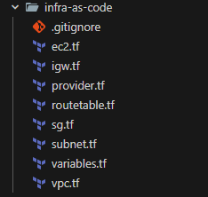  

Console AWS com instância criada  
  

Métricas simples com CloudWatch EC2  
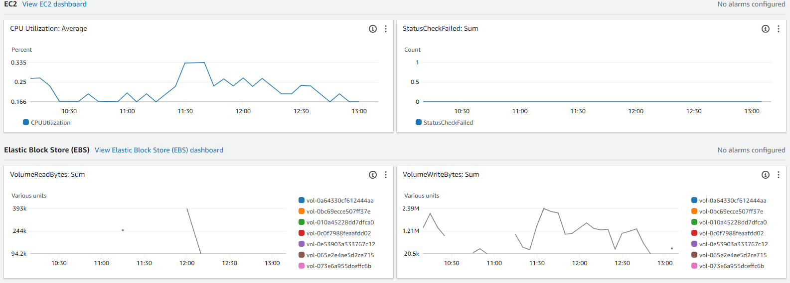

Foi criado dois playbooks via Ansible para instalar de forma automatizada o docker, node e npm na instância ec2 na aws.  
ETAPA 2 - Estrutura dos arquivos .yml para instação do docker e node via ansible na instância ec2.
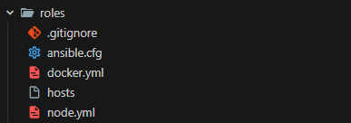  

Playbook docker.yml  
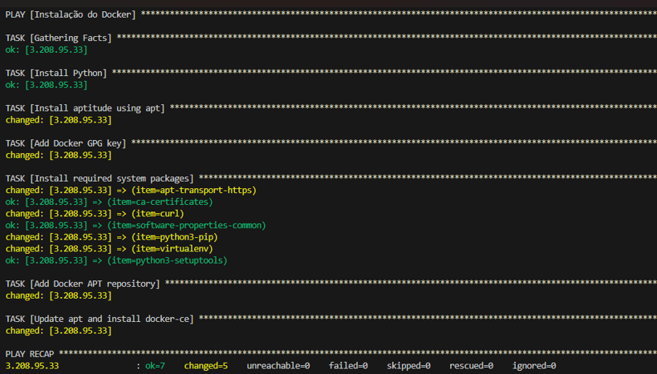  

Playbook node.yml  
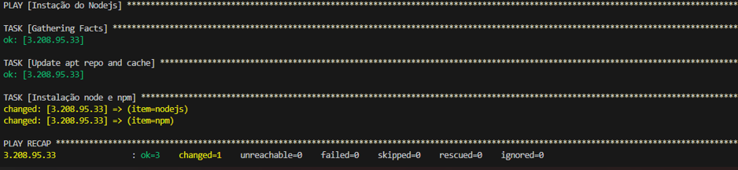

ETAPA 3 - Foi Criado um Dockerfile para conteinerizar aplicação Node.js  
Dockerfile  
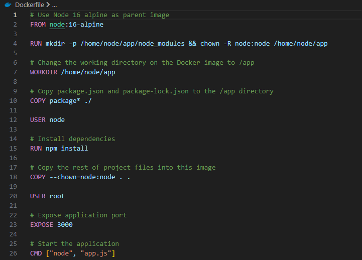

ETAPA 4 - Foi criado arquivo app.js para aplicação rodar na porta 3000 e mostrar a mensagem "Hello World!" e hostname que está rodando.  
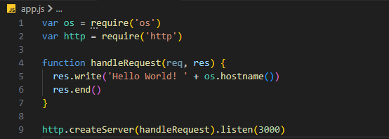

ETAPA 5 -  foi criado um arquivo test.js para quando aplicação do nodejs for copilada npm test trazer no output a mensagem "Fake test".  
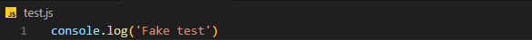

ETAPA 6 - Foi criado um arquivo package.json com nome do projeto, descrição, scripts, versão, repositórios etc ...
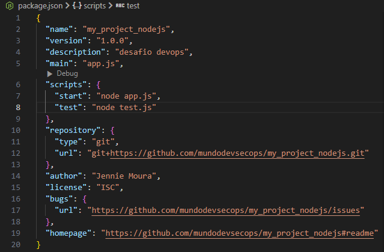    

ETAPA 7 - Foi criado um diretório .circleci contendo um arquivo config.yml este arquivo contém os steps de CI/CD para execução do pipeline.  
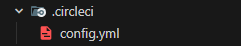  

Explicando etapas do pipeline Checkout →  Test →  Deploy 

Este é o início da construção do pipeline, o que está sendo declarado:  
- A versão 2.1 
- Nome: Criação imagem Docker e deploy    
- A branch: main 
- orbs: são pacotes reutilizáveis ​​de configuração parametrizável que podem ser utilizados em qualquer projeto
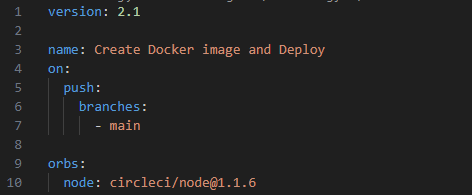  
  
Step Checkout: Este step está usando uma imagem base do circleci/node:14, que fará o chechout código, como clone, commit e branch que está sendo usada, validação das crendenciais via ssh etc ...
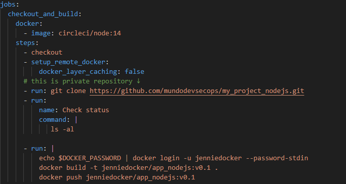  

  
Step Build: Fará o acesso ao docker login, para ocorre com sucesso se faz necessário configurar as variáveis de ambiente na plataforma do circleci.  
Posterior realizará docker build -t na imagem customizada e por fim docker push enviará para repositório Dockerhub.  
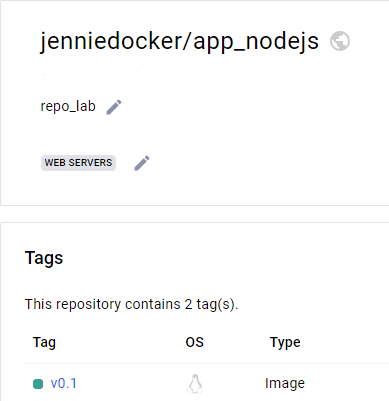

  
Step Test: Aqui será validado comando npm test para ter saída com a mensagem "Fake test"
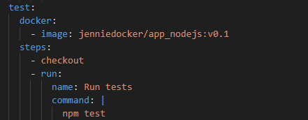  

  
Step Deploy: Aqui etapa final, onde será feito uma conexão via ssh na instância ec2 na aws, realizará um git clone do projeto na instância.  
Posterior realizará docker pull da imagem customizada onde será baixada para máquina, outro comando é docker run usando a imagem customizada e expondo na porta 3000.  
Por fim último comando curl do hostname+port para ter saída da aplicação rodando, ou podendo acessar via navegador 
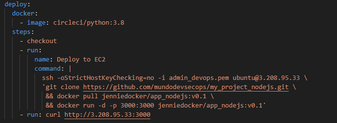  

  
O pipeline no circleci  
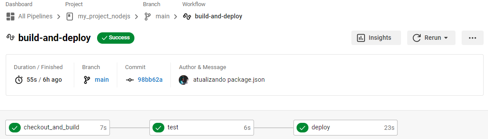  

Acesso via navegador http://3.208.95.33:3000/
